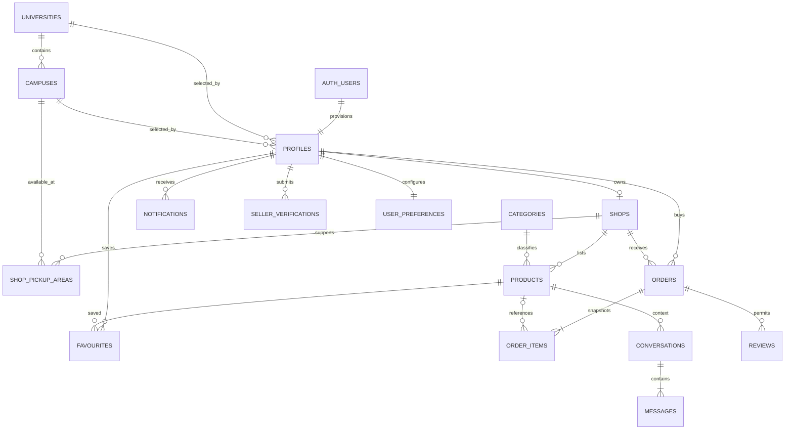

# Data model

Supabase PostgreSQL is evolved through ordered migrations in `marketplace-api/supabase/migrations`. The model pairs relational constraints with RLS policies; the Express service role performs privileged orchestration for workflows that require atomic or cross-record operations.

## Entity relationship diagram

## Core tables

| Domain | Tables | Notes |
| --- | --- | --- |
| Reference | `universities`, `campuses`, `categories` | Publicly readable catalogue metadata. |
| Identity | `profiles`, `seller_verifications`, `user_preferences` | Profile is keyed to `auth.users`; verification has status and private document paths. |
| Commerce | `shops`, `shop_pickup_areas`, `products`, `favourites` | A shop is seller-owned; an active product requires stock and at least one image. |
| Orders | `orders`, `order_items` | One shop per order; fulfilment validation requires either a campus or a delivery address. |
| Communication | `conversations`, `messages`, `notifications` | Conversations are participant-scoped and product-contextual. |
| Reputation | `reviews` | Public product/shop review reads; creation is restricted to completed-order workflow. |

## Important invariants

- Profile roles are `buyer` or `seller`; a buyer must be a student.
- A seller shop has a unique slug and is only publicly visible while open.
- Product status is `draft`, `active`, `sold`, or `paused`. An active product needs positive stock, one to six images, at least one fulfilment method, and a pickup location.
- Order status is `new`, `preparing`, `ready`, `completed`, or `cancelled`.
- An order uses exactly one of `campus_pickup` (campus ID) and `delivery` (non-blank address).
- Order items retain product name and unit price snapshots; the product reference may be set null on deletion.
- A buyer has at most one product-context conversation; participants must be distinct.

## Migrations and seeds

Migrations establish helper functions, reference data, profiles, shops, products, orders, API access hardening, storage, orders/messaging/reviews/preferences, public product slugs, integrity repairs, optional listing fields, conversation types, and profile-provisioning repairs. Local seeds create development users, shops, categories, products, and universities.

Apply pending local migrations with `npx.cmd supabase migration up --local`. Avoid `supabase db reset` during acceptance work: it destroys local data before rebuilding it from migrations and seeds.
