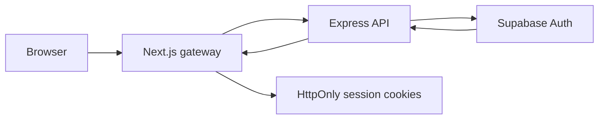

# Authentication and security

## Identity and authorization

Supabase Auth creates the identity. An `auth.users` trigger provisions the matching `public.profiles` row, defaulting safely to buyer unless sign-up metadata explicitly requests a seller role. Buyers must meet the database `is_student` invariant; sellers can submit a private verification request.

Protected Express endpoints use a bearer access token. The API distinguishes identity from authorization: seller product, shop, verification, and seller workspace operations additionally check seller role and shop ownership. Database RLS remains a second line of defense.

## Security controls

| Control | Implementation |
| --- | --- |
| Browser session secrecy | Access and refresh tokens are stored in HttpOnly cookies by the Next.js gateway. |
| Origin protection | Gateway rejects cross-origin unsafe methods. |
| Protected navigation | Next.js proxy refreshes sessions, checks seller role, and sends `no-store` cache controls. |
| API protection | Express uses authentication, request context IDs, rate limiting, CORS allow-list, security headers, body-size limits, and centralized error handling. |
| Data isolation | PostgreSQL RLS scopes profile, shop, inventory, favourite, order, conversation, notification, and preference records to the relevant user. |
| File validation | Product/shop and verification uploads are restricted by file type and content signature; verification data is stored privately. |
| Secret handling | Supabase secret/service-role credentials are server-only. They never belong in browser-exposed `NEXT_PUBLIC_*` variables or committed `.env` files. |

## Storage and uploads

Seller verification accepts JPEG, PNG, and WebP images up to 5 MB. Stored paths are not returned to callers. Product and shop image endpoints use upload middleware; services own the storage lifecycle so deleted or replaced managed images do not remain as orphaned objects.

## Operational guidance

- Set `CORS_ORIGIN` or `CORS_ORIGINS` to every trusted web origin in production.
- Keep `TRUST_PROXY` false unless the deployment topology requires it.
- Treat Supabase secret keys, refresh tokens, session cookies, and verification documents as sensitive.
- Use request IDs from `X-Request-Id` when investigating an API error; do not place credentials, complete profile objects, or full email addresses in logs.
