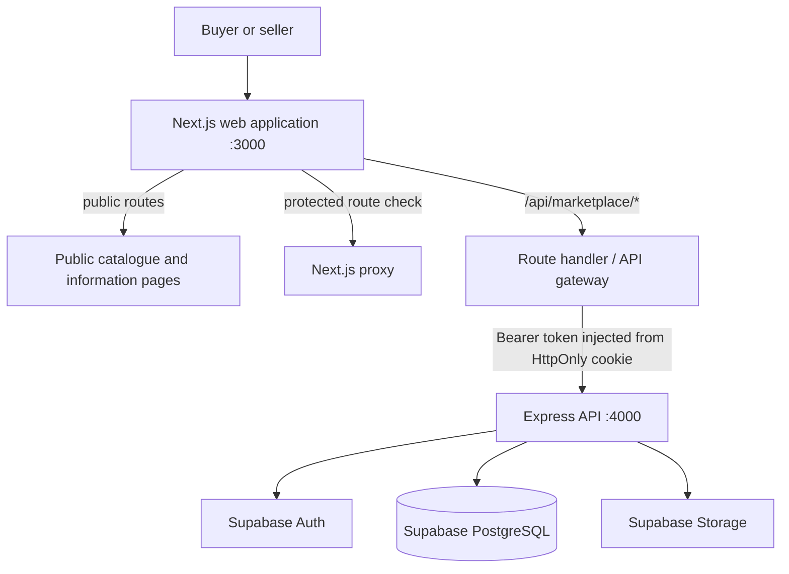
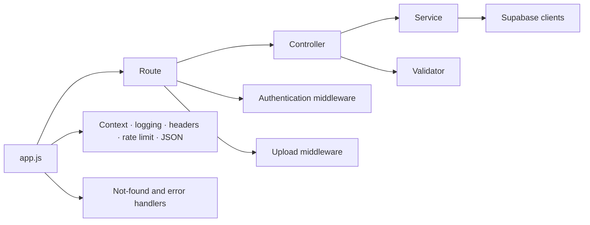

# System overview

## Runtime topology

The web app is the browser-facing boundary. It serves public pages, protected buyer pages, and seller pages. Its catch-all route handler forwards requests to Express, keeping browser traffic on a same-origin `/api/marketplace/*` path. Express owns the versioned application contract and uses Supabase for identity, PostgreSQL data, and object storage.

## Request path

1. The browser calls the Next.js same-origin gateway, never the configured upstream API URL directly.
2. For unsafe requests, the gateway checks that `Origin` matches the current host and protocol.
3. When a request declares authentication is required, the gateway reads the HttpOnly access cookie and can refresh it with the HttpOnly refresh cookie.
4. The gateway forwards selected request headers and an upstream bearer token to `/api/v1` on Express.
5. Express authenticates protected endpoints, applies rate limiting and security headers, invokes service-layer logic, and returns a normalized result.
6. Supabase enforces database constraints, row-level security, and storage policy beneath the API.

## API layering

Routes compose HTTP concerns; controllers translate requests and responses; services contain domain operations and data access. `app.js` mounts `/api/v1` and the temporary compatibility endpoints, while `server.js` loads environment configuration and starts the listener.

## Web route groups

The App Router uses route groups to organize layouts without changing URLs:

| Group | URL examples | Purpose |
| --- | --- | --- |
| `(public)` | `/`, `/categories`, `/products/:id`, `/search` | Catalogue and static information |
| `(auth)` | `/login`, `/signup`, `/forgot-password` | Account recovery and entry |
| `(marketplace)` | `/cart`, `/favourites`, `/messages`, `/orders`, `/profile` | Signed-in buyer surfaces |
| `(seller)` | `/seller`, `/seller/products`, `/seller/orders` | Seller workspace |

The proxy protects signed-in routes and additionally checks `profile.role === "seller"` before seller routes are served. Responses for protected pages are marked `private, no-store` to reduce stale back-navigation and BFCache exposure.
