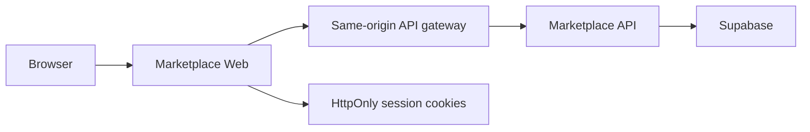

# Marketplace Documentation

Marketplace is a campus-oriented multi-vendor marketplace. Buyers discover listings, save products, message sellers, place delivery or campus-pickup orders, and review completed purchases. Sellers create one shop, manage listings and fulfillment, communicate with buyers, and view shop metrics.

This site documents the implemented application across three independently deployed repositories:

| Repository | Responsibility | Primary technology |
| --- | --- | --- |
| `marketplace-web` | Customer and seller-facing application, session gateway | Next.js 16, React 19, TypeScript, Tailwind CSS 4 |
| `marketplace-api` | Versioned business API, file handling, database orchestration | Node.js, Express 5, Supabase JS |
| `marketplace-docs` | This static engineering reference | MkDocs Material, GitHub Pages |

## Start here

- [System overview](architecture/system-overview.md) explains how the browser, Next.js gateway, Express API, and Supabase fit together.
- [Technology and design decisions](product/technology-and-design-decisions.md) explains why the application uses this stack and these boundaries.
- [User journeys](product/user-journeys.md) maps buyer and seller capabilities end to end.
- [Endpoint reference](api/endpoints.md) lists the current `/api/v1` contract.
- [Data model](architecture/data-model.md) documents the PostgreSQL schema and its relationships.
- [Local development](operations/local-development.md) provides the supported Windows workflow.

## Scope and source of truth

This documentation describes the checked-in code and Supabase migrations. The API contract is versioned under `/api/v1`; legacy unversioned auth and product routes are temporary compatibility aliases. Runtime configuration, deployed URLs, and secrets are intentionally not recorded here.

## Architecture at a glance

