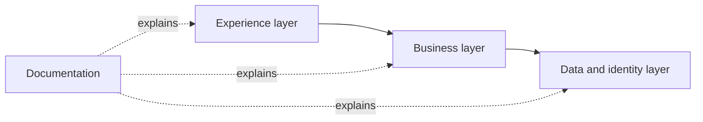
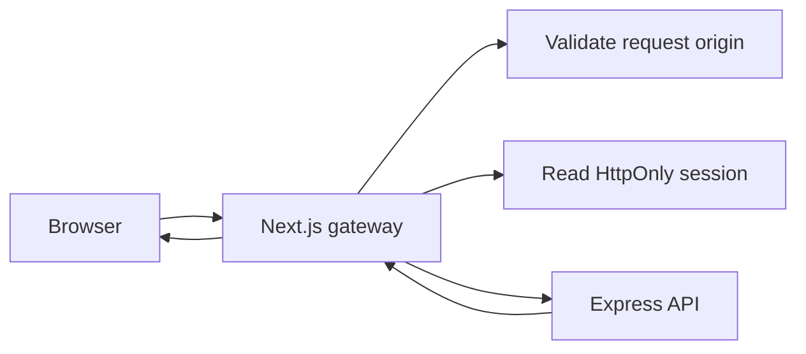

# Technology and design decisions

Marketplace is designed around a practical problem: a campus community needs a trustworthy way for students to discover, sell, and fulfil products without turning a student project into an unnecessarily complex distributed platform. The architecture deliberately separates a fast, polished web experience from a business API and a database platform that already provides identity, relational data, storage, and security controls.

## Why this stack

| Choice | Why it fits Marketplace | Trade-off accepted |
| --- | --- | --- |
| Next.js + React + TypeScript | It supports a responsive marketplace UI, file-based routes, server rendering where useful, and typed component/API contracts. App Router route groups map cleanly to public, buyer, seller, and authentication experiences. | Next.js introduces server/client boundaries that require care around cookies, caching, and browser-only state. |
| Tailwind CSS | The marketplace has many repeated UI states—product cards, forms, badges, navigation, responsive layouts. Utility styling makes those states quick to compose while shared theme styles keep the interface coherent. | Consistency still relies on reusable components and design discipline; utility classes alone do not create a design system. |
| Express 5 API | A lightweight, explicit HTTP layer keeps product, order, messaging, file-upload, validation, and error policies independent from the presentation app. It can also serve future mobile or partner clients through the same `/api/v1` contract. | There are two deployable applications to configure and observe rather than a single all-in-one application. |
| Supabase | PostgreSQL, Auth, Storage, local Docker development, migrations, and row-level security remove a large amount of infrastructure work while retaining a relational model appropriate for shops, orders, stock, and reviews. | Supabase configuration, privileges, RLS, and migration history must be treated as real production infrastructure. |
| GitHub Pages + MkDocs Material | Engineering documentation is static, searchable, version-controlled, inexpensive to host, and readable without running the application. Mermaid keeps architecture and data relationships close to the written explanation. | GitHub Pages serves documentation only; it cannot host the dynamic Next.js or Express application. |

## Why the application is separated into web, API, and data layers

The separation is intentional:

- The **web app** owns pages, interaction, accessibility, responsive behavior, and a safe browser session boundary.
- The **API** owns business rules that must not be trusted to a browser: seller ownership, stock reservation, order transitions, review eligibility, notification creation, and upload handling.
- The **database** owns durable relationships, constraints, RLS policies, and transactional consistency.
- The **docs site** is independent so it can explain and evolve with all three systems without being coupled to an application deployment.

This makes changes safer. A seller form cannot make itself authoritative by sending a different `shop_id`; the API derives and checks ownership. A browser quantity control is a helpful availability signal, but the database/API remains authoritative when stock is reserved. An order item keeps a product name and price snapshot so history survives product edits or deletion.

## Why the web uses a same-origin gateway

The browser calls `/api/marketplace/*` on the Next.js application, which forwards to Express `/api/v1/*`.

This decision reduces browser exposure to access and refresh tokens, avoids browser-side CORS complexity for normal web traffic, gives the application one place to refresh sessions, and lets protected route checks happen before seller-only pages render. Direct API clients are still possible, but they use the explicit bearer-token contract.

## Why roles and workflows are explicit

Marketplace has two distinct users with different responsibilities:

| Buyer | Seller |
| --- | --- |
| Browse, search, save, message, checkout, track, review | Verify identity, create a shop, publish inventory, reply, fulfil orders, view metrics |

Treating these as a product boundary improves clarity and security. Buyer surfaces do not expose seller controls. Seller routes require a seller profile and recover gracefully if a shop has not been created. The order lifecycle is explicit rather than a generic editable status, which prevents invalid states and provides meaningful notifications for both parties.

## Why PostgreSQL constraints and RLS matter

Application code can have bugs or be bypassed. Database constraints ensure essential truths regardless of which code path attempts a write: positive prices, non-negative stock, valid fulfilment details, valid lifecycle values, active-listing readiness, and distinct conversation participants. RLS then scopes records to their owner or participant.

The API service role is used only where a workflow needs privileged orchestration, such as atomic checkout or managed storage. It must still explicitly enforce the caller's identity, role, and ownership; a service role bypasses RLS and is not a substitute for application authorization.

## What this architecture deliberately does not solve yet

The current design is a strong foundation, not a claim that every marketplace concern is complete. Production adoption still requires operational work appropriate to the deployment: hosted Supabase configuration, domain-specific CORS settings, monitoring, backup and retention policy, admin review/moderation operations, payment/provider decisions if payments are introduced, and live end-to-end acceptance against deployed services.
