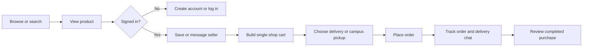
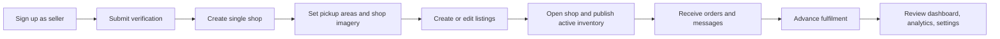
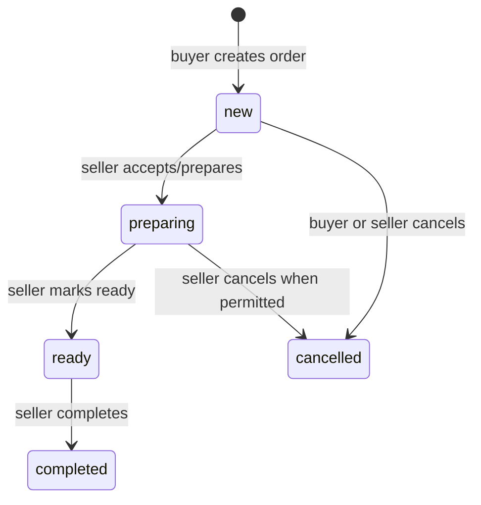

# User journeys

## Buyer journey

Buyers can explore the catalogue, categories, product details, public shops, search, guidelines, safety, terms, privacy, help, contact, and reporting pages without a session. A session is required for favourites, messages, orders, profile actions, checkout, and reviews.

## Seller journey

Seller access is role-gated. A seller without a shop sees the setup-required flow rather than an assumed shop. Seller tooling includes inventory CRUD and images, shop profile and pickup-area configuration, order handling, shared conversation UI, analytics, and notification preferences.

## Order lifecycle

Orders are limited to one shop per checkout. The order creation workflow calculates totals and reserves stock atomically. Order items retain a name and unit-price snapshot so history remains meaningful if a product later changes or is deleted.
